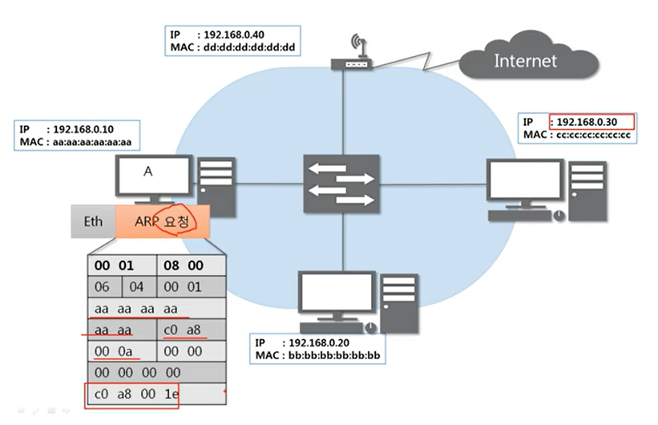
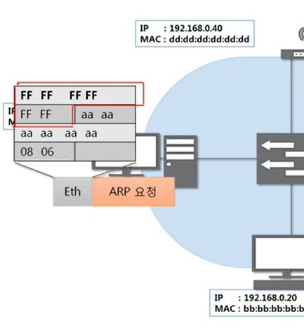
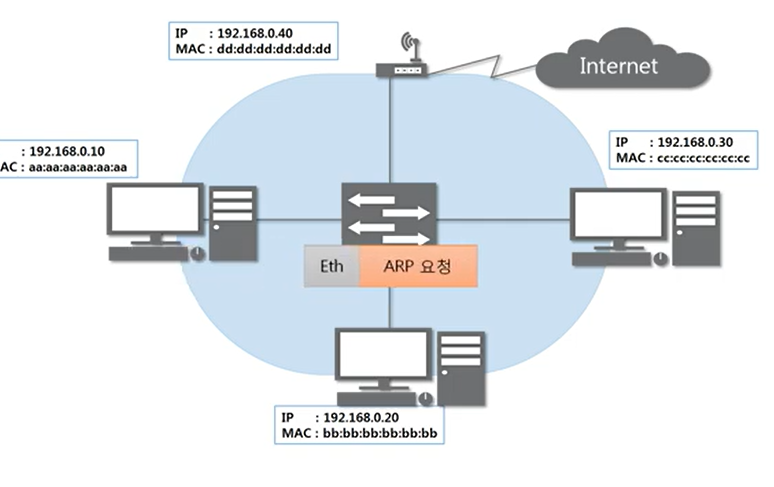
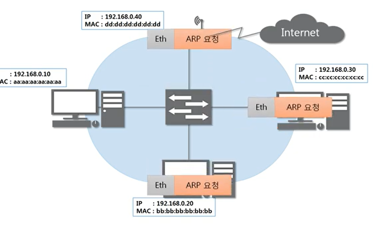
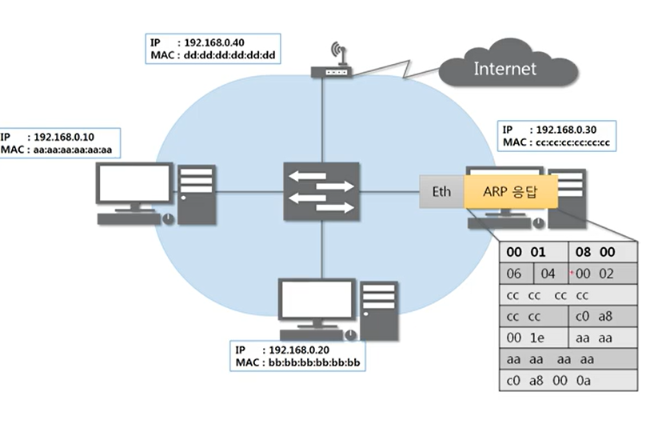
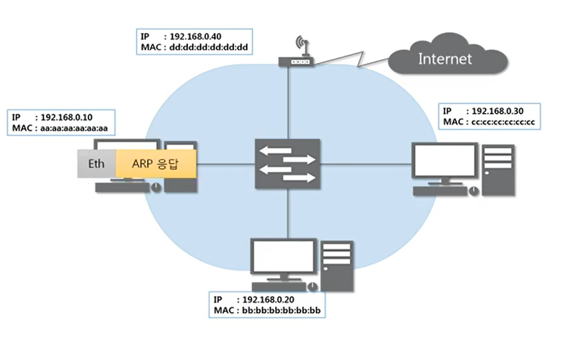
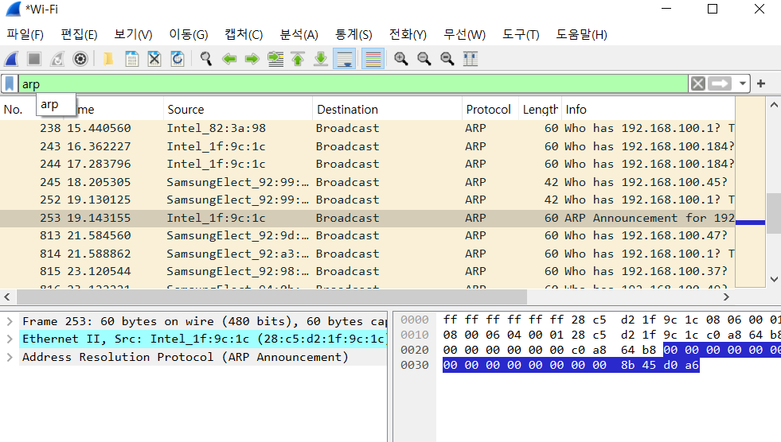
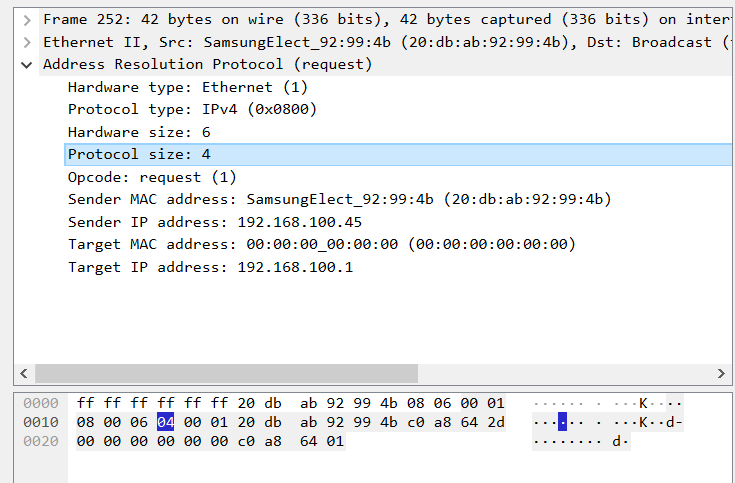

# 5장 ARP 프로토콜

## ARP가 하는 일
- ARP 프로토콜은 같은 네트워크 대역에서 통신을 하기 위해 필요한 **MAC 주소**를 IP 주소를 이용해서 알아오는 프로토콜이다.

- 같은 네트워크 대역에서 통신을 하더라도, 데이터를 보내기 위해서는 7계층부터 캡슐화를 통해 데이터를 보내기 때문에 IP주소와 MAC주소가 모두 필요하다. 이때 IP주소는 알고 MAC주소는 모르더라도 ARP를 통해 통신이 가능하다.

  

- Hardware type : 0001 - 이더넷
- Protocol type : 0800 - IPv4
- Hardware Address Line 맥주소의 길이 06
- Protocol Address Length : IPv4의 주소 길이 04
- Opcode : 000_ 어떻게 동작하는지 나타내는 코드 : 요청이면 0001, 응답이면 0002

-> 앞에는 고정값, 달라지는건 Opcode, 뒤는 모두 주소

## ARP 프로토콜의 통신과정
A 컴퓨터가 C컴퓨터에게 ARP를 요청할때

  
이더넷  
  
같은 네트워크대역의 모든 아이들에게 보내줌  
  
2계층까지만 디캡슐레이션 함
  
같은 내역을 받은 모든 컴퓨터에게 보냄 -- 목적지 IP 주소가 자기와 같은 컴퓨터만 응답을 보냄  
  
출발지 IP 주소에 자기의 MAC주소를 써서 보내줌.  

전달해줌    
  
ARP 캐시 테이블  
  

## ARP 캐시 테이블
> 나와 통신했던 컴퓨터들

  
통신했던 컴퓨터들의 주소는 ARP 테이블에 남는다.

- 캐시테이블 - 일정 시간이 지나면 삭제됨 

---

## 실습
1. ARP 캐시 테이블 확인  
- `cmd` 들어가서 `arp -a` 입력  
 
 - 3계층. 같은 네트워크 대역 안에서만 쓰인다. 

2.  ARP 프로토콜 분석하기
- wireshark 들어가서 `arp` 검색
  
물음표가 붙은 것은 요청하는 거.

자세히 보면  
  
  
  2계층 이더넷 encapsulation  

  